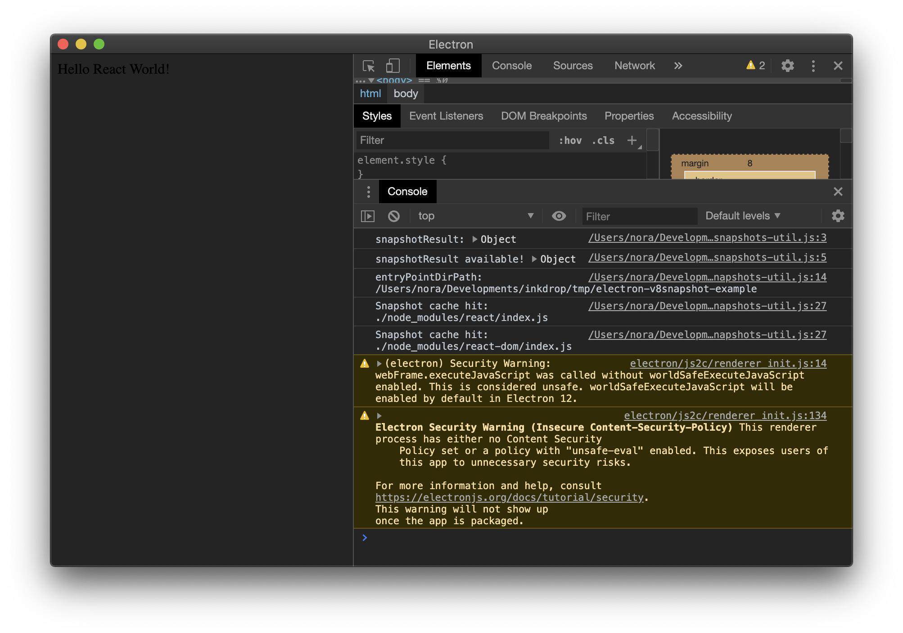

# Example for using custom v8 snapshots in an Electron app

Generate a custom v8 snapshots using [electron-link](https://github.com/atom/electron-link) and [mksnapshot](https://github.com/electron/mksnapshot).

## How it works

### Generate v8 snapshots

Run the following command:

```sh
npm run generave-v8-snapshots
```

It generates v8 snapshots containing `react` and `react-dom` libraries from `<PROJECT_DIR>/snapshot.js`.
You should get `v8_context_snapshot.bin` in the project directory.

### Copy the snapshots into Electron

```sh
npm run copy-v8-snapshots
```

It copies `v8_context_snapshot.bin` file to the Electron's binary.

### Start the Electron app

The electron app will load those libraries from the snapshots.
You should get a window like so:



As you can see, `react` and `react-dom` libraries are loaded from the v8 snapshot cache.

## Credit

Created by Takuya Matsuyama ([Twitter](https://twitter.com/inkdrop_app)) for his work called [Inkdrop](https://www.inkdrop.app/), a cross-platform Markdown note-taking app.
